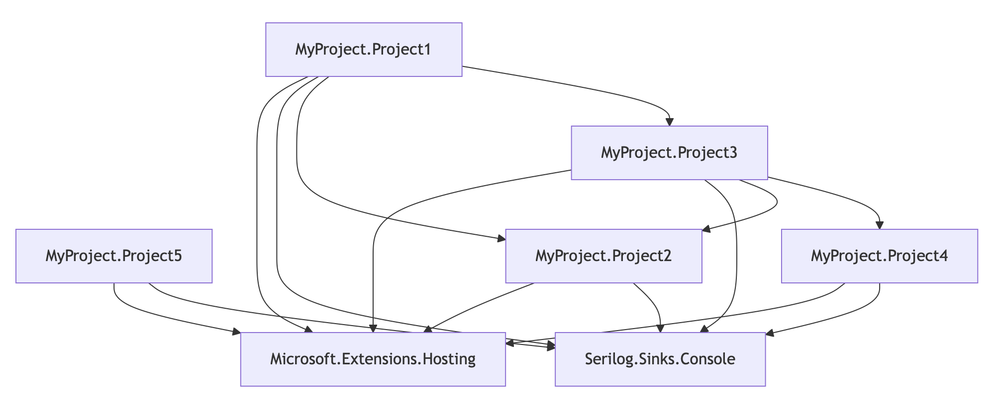
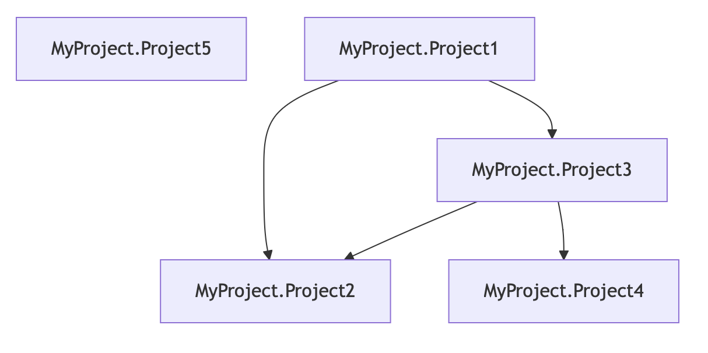
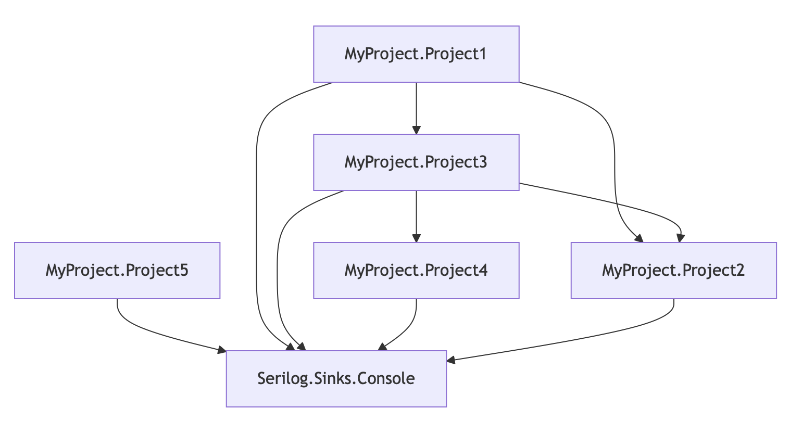

# nuget-graph

## Description

A POC approach to visualising Nuget Dependencies, specifically related to planning structured updates, in a sensible order.

Also allows for separation of concerns/groups where possible for parallel working.

Creates and opens HTML with an embedded Mermaid Graph.

> [!IMPORTANT]  
> Requires all 'owned' repositories to be added to a specific root directory which commands are then run from

## Setup/Installation

Run commands from the Solution level directory

```shell
# build and package cli tool
dotnet pack

# install
dotnet tool install --global --add-source nuget-graph/nupkg nuget-graph

# update
dotnet tool update --global --add-source nuget-graph/nupkg nuget-graph

# uninstall
dotnet tool uninstall cli-poc --global
```

## Usage

The tool accepts an optional set of CLI Args that can filter the graph.

Any args passed will be classed as "Allowed Packages" and only those will be visualised.

See examples directory for specific output data.

All examples run from root directory that is required to be visualised.

## Example 1 - Base / No Args

```shell
nuget-graph
```

Output HTML : [base](nuget-graph/example/output_base.html)



## Example 2 -  Singular Arg

```shell
nuget-graph MyProject
```

Output HTML : [single](nuget-graph/example/output_single_arg.html)



## Example 3 - Mulitple Args

```shell
nuget-graph MyProject Serilog
```

Output HTML : [multiple](nuget-graph/example/output_multiple_args.html)



## Todo

1. Add dependency list output and ordering for each visualised group?
2. Add Package Versions to output
